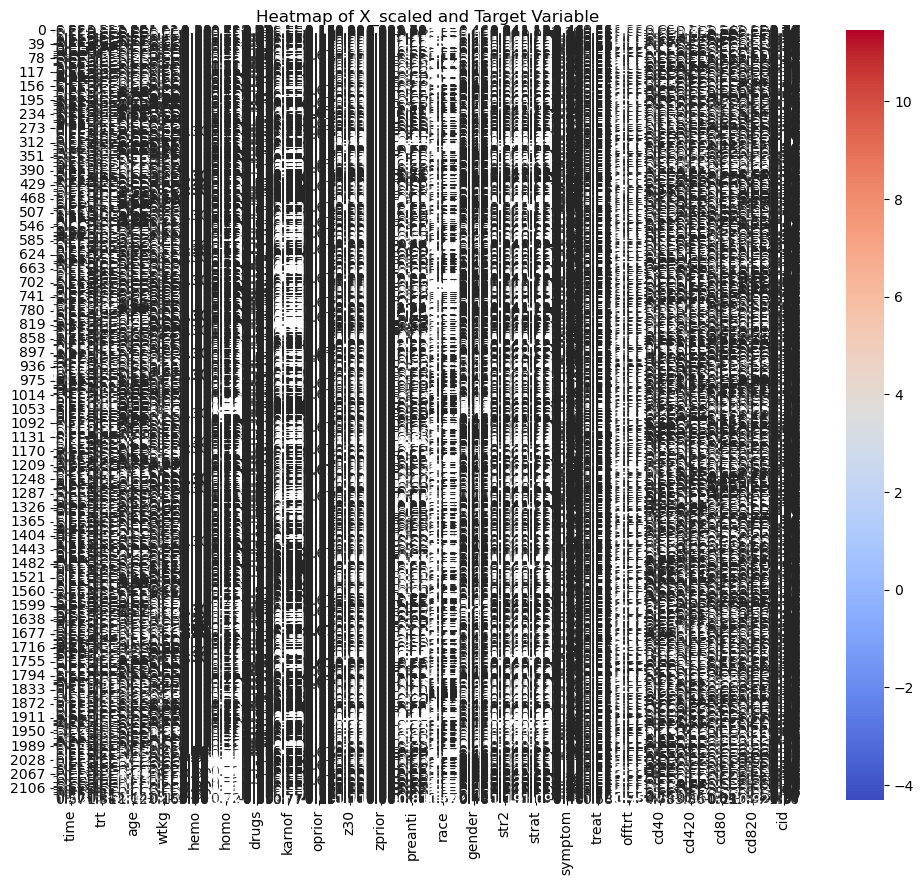
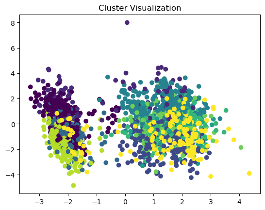
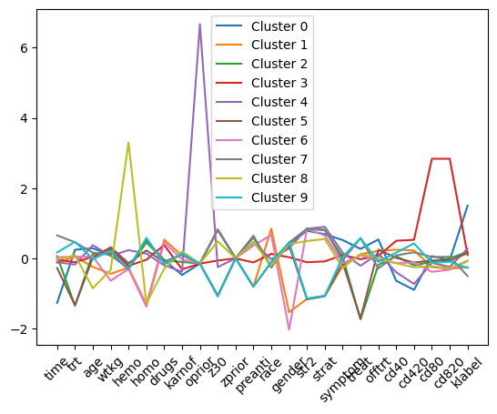
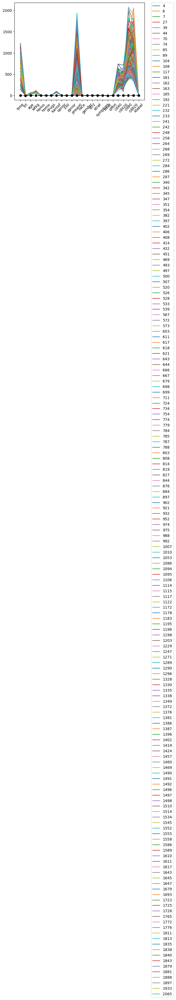
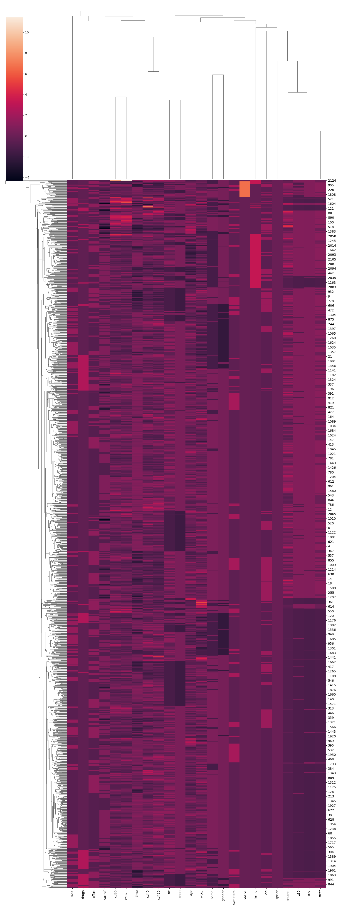

---
editor_options:
  markdown:
    wrap: 72
output: pdf_document
---
# AIDS Clinical Study Analysis

# Brashon Ford

## Local library import

We import all the required local libraries libraries

`python jupyter={"outputs_hidden": true} pip install --upgrade --user nbconvert`

`python jupyter={"outputs_hidden": true} pip install --upgrade jupyter nbconvert`


```python
pip install notebook --upgrade 
```

    Requirement already satisfied: notebook in /Users/brashonford/anaconda3/lib/python3.11/site-packages (7.0.7)
    Requirement already satisfied: jupyter-server<3,>=2.4.0 in /Users/brashonford/anaconda3/lib/python3.11/site-packages (from notebook) (2.12.5)
    Requirement already satisfied: jupyterlab-server<3,>=2.22.1 in /Users/brashonford/anaconda3/lib/python3.11/site-packages (from notebook) (2.25.2)
    Requirement already satisfied: jupyterlab<5,>=4.0.2 in /Users/brashonford/anaconda3/lib/python3.11/site-packages (from notebook) (4.0.12)
    Requirement already satisfied: notebook-shim<0.3,>=0.2 in /Users/brashonford/anaconda3/lib/python3.11/site-packages (from notebook) (0.2.2)
    Requirement already satisfied: tornado>=6.2.0 in /Users/brashonford/anaconda3/lib/python3.11/site-packages (from notebook) (6.3.2)
    Requirement already satisfied: anyio>=3.1.0 in /Users/brashonford/anaconda3/lib/python3.11/site-packages (from jupyter-server<3,>=2.4.0->notebook) (3.5.0)
    Requirement already satisfied: argon2-cffi in /Users/brashonford/anaconda3/lib/python3.11/site-packages (from jupyter-server<3,>=2.4.0->notebook) (21.3.0)
    Requirement already satisfied: jinja2 in /Users/brashonford/anaconda3/lib/python3.11/site-packages (from jupyter-server<3,>=2.4.0->notebook) (3.1.2)
    Requirement already satisfied: jupyter-client>=7.4.4 in /Users/brashonford/anaconda3/lib/python3.11/site-packages (from jupyter-server<3,>=2.4.0->notebook) (7.4.9)
    Requirement already satisfied: jupyter-core!=5.0.*,>=4.12 in /Users/brashonford/anaconda3/lib/python3.11/site-packages (from jupyter-server<3,>=2.4.0->notebook) (5.3.0)
    Requirement already satisfied: jupyter-events>=0.9.0 in /Users/brashonford/anaconda3/lib/python3.11/site-packages (from jupyter-server<3,>=2.4.0->notebook) (0.9.0)
    Requirement already satisfied: jupyter-server-terminals in /Users/brashonford/anaconda3/lib/python3.11/site-packages (from jupyter-server<3,>=2.4.0->notebook) (0.5.2)
    Requirement already satisfied: nbconvert>=6.4.4 in /Users/brashonford/.local/lib/python3.11/site-packages (from jupyter-server<3,>=2.4.0->notebook) (7.14.2)
    Requirement already satisfied: nbformat>=5.3.0 in /Users/brashonford/anaconda3/lib/python3.11/site-packages (from jupyter-server<3,>=2.4.0->notebook) (5.7.0)
    Requirement already satisfied: overrides in /Users/brashonford/anaconda3/lib/python3.11/site-packages (from jupyter-server<3,>=2.4.0->notebook) (7.7.0)
    Requirement already satisfied: packaging in /Users/brashonford/anaconda3/lib/python3.11/site-packages (from jupyter-server<3,>=2.4.0->notebook) (23.0)
    Requirement already satisfied: prometheus-client in /Users/brashonford/anaconda3/lib/python3.11/site-packages (from jupyter-server<3,>=2.4.0->notebook) (0.14.1)
    Requirement already satisfied: pyzmq>=24 in /Users/brashonford/anaconda3/lib/python3.11/site-packages (from jupyter-server<3,>=2.4.0->notebook) (25.1.2)
    Requirement already satisfied: send2trash>=1.8.2 in /Users/brashonford/anaconda3/lib/python3.11/site-packages (from jupyter-server<3,>=2.4.0->notebook) (1.8.2)
    Requirement already satisfied: terminado>=0.8.3 in /Users/brashonford/anaconda3/lib/python3.11/site-packages (from jupyter-server<3,>=2.4.0->notebook) (0.17.1)
    Requirement already satisfied: traitlets>=5.6.0 in /Users/brashonford/anaconda3/lib/python3.11/site-packages (from jupyter-server<3,>=2.4.0->notebook) (5.7.1)
    Requirement already satisfied: websocket-client in /Users/brashonford/anaconda3/lib/python3.11/site-packages (from jupyter-server<3,>=2.4.0->notebook) (0.58.0)
    Requirement already satisfied: async-lru>=1.0.0 in /Users/brashonford/anaconda3/lib/python3.11/site-packages (from jupyterlab<5,>=4.0.2->notebook) (2.0.4)
    Requirement already satisfied: ipykernel in /Users/brashonford/anaconda3/lib/python3.11/site-packages (from jupyterlab<5,>=4.0.2->notebook) (6.19.2)
    Requirement already satisfied: jupyter-lsp>=2.0.0 in /Users/brashonford/anaconda3/lib/python3.11/site-packages (from jupyterlab<5,>=4.0.2->notebook) (2.2.2)
    Requirement already satisfied: babel>=2.10 in /Users/brashonford/anaconda3/lib/python3.11/site-packages (from jupyterlab-server<3,>=2.22.1->notebook) (2.11.0)
    Requirement already satisfied: json5>=0.9.0 in /Users/brashonford/anaconda3/lib/python3.11/site-packages (from jupyterlab-server<3,>=2.22.1->notebook) (0.9.6)
    Requirement already satisfied: jsonschema>=4.18.0 in /Users/brashonford/anaconda3/lib/python3.11/site-packages (from jupyterlab-server<3,>=2.22.1->notebook) (4.21.1)
    Requirement already satisfied: requests>=2.31 in /Users/brashonford/anaconda3/lib/python3.11/site-packages (from jupyterlab-server<3,>=2.22.1->notebook) (2.31.0)
    Requirement already satisfied: idna>=2.8 in /Users/brashonford/anaconda3/lib/python3.11/site-packages (from anyio>=3.1.0->jupyter-server<3,>=2.4.0->notebook) (3.4)
    Requirement already satisfied: sniffio>=1.1 in /Users/brashonford/anaconda3/lib/python3.11/site-packages (from anyio>=3.1.0->jupyter-server<3,>=2.4.0->notebook) (1.2.0)
    Requirement already satisfied: pytz>=2015.7 in /Users/brashonford/anaconda3/lib/python3.11/site-packages (from babel>=2.10->jupyterlab-server<3,>=2.22.1->notebook) (2022.7)
    Requirement already satisfied: MarkupSafe>=2.0 in /Users/brashonford/anaconda3/lib/python3.11/site-packages (from jinja2->jupyter-server<3,>=2.4.0->notebook) (2.1.1)
    Requirement already satisfied: attrs>=22.2.0 in /Users/brashonford/anaconda3/lib/python3.11/site-packages (from jsonschema>=4.18.0->jupyterlab-server<3,>=2.22.1->notebook) (23.2.0)
    Requirement already satisfied: jsonschema-specifications>=2023.03.6 in /Users/brashonford/anaconda3/lib/python3.11/site-packages (from jsonschema>=4.18.0->jupyterlab-server<3,>=2.22.1->notebook) (2023.12.1)
    Requirement already satisfied: referencing>=0.28.4 in /Users/brashonford/anaconda3/lib/python3.11/site-packages (from jsonschema>=4.18.0->jupyterlab-server<3,>=2.22.1->notebook) (0.33.0)
    Requirement already satisfied: rpds-py>=0.7.1 in /Users/brashonford/anaconda3/lib/python3.11/site-packages (from jsonschema>=4.18.0->jupyterlab-server<3,>=2.22.1->notebook) (0.17.1)
    Requirement already satisfied: entrypoints in /Users/brashonford/anaconda3/lib/python3.11/site-packages (from jupyter-client>=7.4.4->jupyter-server<3,>=2.4.0->notebook) (0.4)
    Requirement already satisfied: nest-asyncio>=1.5.4 in /Users/brashonford/anaconda3/lib/python3.11/site-packages (from jupyter-client>=7.4.4->jupyter-server<3,>=2.4.0->notebook) (1.5.6)
    Requirement already satisfied: python-dateutil>=2.8.2 in /Users/brashonford/anaconda3/lib/python3.11/site-packages (from jupyter-client>=7.4.4->jupyter-server<3,>=2.4.0->notebook) (2.8.2)
    Requirement already satisfied: platformdirs>=2.5 in /Users/brashonford/anaconda3/lib/python3.11/site-packages (from jupyter-core!=5.0.*,>=4.12->jupyter-server<3,>=2.4.0->notebook) (2.5.2)
    Requirement already satisfied: python-json-logger>=2.0.4 in /Users/brashonford/anaconda3/lib/python3.11/site-packages (from jupyter-events>=0.9.0->jupyter-server<3,>=2.4.0->notebook) (2.0.7)
    Requirement already satisfied: pyyaml>=5.3 in /Users/brashonford/anaconda3/lib/python3.11/site-packages (from jupyter-events>=0.9.0->jupyter-server<3,>=2.4.0->notebook) (6.0)
    Requirement already satisfied: rfc3339-validator in /Users/brashonford/anaconda3/lib/python3.11/site-packages (from jupyter-events>=0.9.0->jupyter-server<3,>=2.4.0->notebook) (0.1.4)
    Requirement already satisfied: rfc3986-validator>=0.1.1 in /Users/brashonford/anaconda3/lib/python3.11/site-packages (from jupyter-events>=0.9.0->jupyter-server<3,>=2.4.0->notebook) (0.1.1)
    Requirement already satisfied: beautifulsoup4 in /Users/brashonford/anaconda3/lib/python3.11/site-packages (from nbconvert>=6.4.4->jupyter-server<3,>=2.4.0->notebook) (4.12.2)
    Requirement already satisfied: bleach!=5.0.0 in /Users/brashonford/anaconda3/lib/python3.11/site-packages (from nbconvert>=6.4.4->jupyter-server<3,>=2.4.0->notebook) (4.1.0)
    Requirement already satisfied: defusedxml in /Users/brashonford/anaconda3/lib/python3.11/site-packages (from nbconvert>=6.4.4->jupyter-server<3,>=2.4.0->notebook) (0.7.1)
    Requirement already satisfied: jupyterlab-pygments in /Users/brashonford/anaconda3/lib/python3.11/site-packages (from nbconvert>=6.4.4->jupyter-server<3,>=2.4.0->notebook) (0.1.2)
    Requirement already satisfied: mistune<4,>=2.0.3 in /Users/brashonford/.local/lib/python3.11/site-packages (from nbconvert>=6.4.4->jupyter-server<3,>=2.4.0->notebook) (3.0.2)
    Requirement already satisfied: nbclient>=0.5.0 in /Users/brashonford/anaconda3/lib/python3.11/site-packages (from nbconvert>=6.4.4->jupyter-server<3,>=2.4.0->notebook) (0.5.13)
    Requirement already satisfied: pandocfilters>=1.4.1 in /Users/brashonford/anaconda3/lib/python3.11/site-packages (from nbconvert>=6.4.4->jupyter-server<3,>=2.4.0->notebook) (1.5.0)
    Requirement already satisfied: pygments>=2.4.1 in /Users/brashonford/anaconda3/lib/python3.11/site-packages (from nbconvert>=6.4.4->jupyter-server<3,>=2.4.0->notebook) (2.15.1)
    Requirement already satisfied: tinycss2 in /Users/brashonford/anaconda3/lib/python3.11/site-packages (from nbconvert>=6.4.4->jupyter-server<3,>=2.4.0->notebook) (1.2.1)
    Requirement already satisfied: fastjsonschema in /Users/brashonford/anaconda3/lib/python3.11/site-packages (from nbformat>=5.3.0->jupyter-server<3,>=2.4.0->notebook) (2.16.2)
    Requirement already satisfied: charset-normalizer<4,>=2 in /Users/brashonford/anaconda3/lib/python3.11/site-packages (from requests>=2.31->jupyterlab-server<3,>=2.22.1->notebook) (2.0.4)
    Requirement already satisfied: urllib3<3,>=1.21.1 in /Users/brashonford/anaconda3/lib/python3.11/site-packages (from requests>=2.31->jupyterlab-server<3,>=2.22.1->notebook) (1.26.16)
    Requirement already satisfied: certifi>=2017.4.17 in /Users/brashonford/anaconda3/lib/python3.11/site-packages (from requests>=2.31->jupyterlab-server<3,>=2.22.1->notebook) (2023.7.22)
    Requirement already satisfied: ptyprocess in /Users/brashonford/anaconda3/lib/python3.11/site-packages (from terminado>=0.8.3->jupyter-server<3,>=2.4.0->notebook) (0.7.0)
    Requirement already satisfied: argon2-cffi-bindings in /Users/brashonford/anaconda3/lib/python3.11/site-packages (from argon2-cffi->jupyter-server<3,>=2.4.0->notebook) (21.2.0)
    Requirement already satisfied: appnope in /Users/brashonford/anaconda3/lib/python3.11/site-packages (from ipykernel->jupyterlab<5,>=4.0.2->notebook) (0.1.2)
    Requirement already satisfied: comm>=0.1.1 in /Users/brashonford/anaconda3/lib/python3.11/site-packages (from ipykernel->jupyterlab<5,>=4.0.2->notebook) (0.1.2)
    Requirement already satisfied: debugpy>=1.0 in /Users/brashonford/anaconda3/lib/python3.11/site-packages (from ipykernel->jupyterlab<5,>=4.0.2->notebook) (1.6.7)
    Requirement already satisfied: ipython>=7.23.1 in /Users/brashonford/anaconda3/lib/python3.11/site-packages (from ipykernel->jupyterlab<5,>=4.0.2->notebook) (8.12.0)
    Requirement already satisfied: matplotlib-inline>=0.1 in /Users/brashonford/anaconda3/lib/python3.11/site-packages (from ipykernel->jupyterlab<5,>=4.0.2->notebook) (0.1.6)
    Requirement already satisfied: psutil in /Users/brashonford/anaconda3/lib/python3.11/site-packages (from ipykernel->jupyterlab<5,>=4.0.2->notebook) (5.9.0)
    Requirement already satisfied: six in /Users/brashonford/anaconda3/lib/python3.11/site-packages (from websocket-client->jupyter-server<3,>=2.4.0->notebook) (1.16.0)
    Requirement already satisfied: webencodings in /Users/brashonford/anaconda3/lib/python3.11/site-packages (from bleach!=5.0.0->nbconvert>=6.4.4->jupyter-server<3,>=2.4.0->notebook) (0.5.1)
    Requirement already satisfied: backcall in /Users/brashonford/anaconda3/lib/python3.11/site-packages (from ipython>=7.23.1->ipykernel->jupyterlab<5,>=4.0.2->notebook) (0.2.0)
    Requirement already satisfied: decorator in /Users/brashonford/anaconda3/lib/python3.11/site-packages (from ipython>=7.23.1->ipykernel->jupyterlab<5,>=4.0.2->notebook) (5.1.1)
    Requirement already satisfied: jedi>=0.16 in /Users/brashonford/anaconda3/lib/python3.11/site-packages (from ipython>=7.23.1->ipykernel->jupyterlab<5,>=4.0.2->notebook) (0.18.1)
    Requirement already satisfied: pickleshare in /Users/brashonford/anaconda3/lib/python3.11/site-packages (from ipython>=7.23.1->ipykernel->jupyterlab<5,>=4.0.2->notebook) (0.7.5)
    Requirement already satisfied: prompt-toolkit!=3.0.37,<3.1.0,>=3.0.30 in /Users/brashonford/anaconda3/lib/python3.11/site-packages (from ipython>=7.23.1->ipykernel->jupyterlab<5,>=4.0.2->notebook) (3.0.36)
    Requirement already satisfied: stack-data in /Users/brashonford/anaconda3/lib/python3.11/site-packages (from ipython>=7.23.1->ipykernel->jupyterlab<5,>=4.0.2->notebook) (0.2.0)
    Requirement already satisfied: pexpect>4.3 in /Users/brashonford/anaconda3/lib/python3.11/site-packages (from ipython>=7.23.1->ipykernel->jupyterlab<5,>=4.0.2->notebook) (4.8.0)
    Requirement already satisfied: fqdn in /Users/brashonford/anaconda3/lib/python3.11/site-packages (from jsonschema>=4.18.0->jupyterlab-server<3,>=2.22.1->notebook) (1.5.1)
    Requirement already satisfied: isoduration in /Users/brashonford/anaconda3/lib/python3.11/site-packages (from jsonschema>=4.18.0->jupyterlab-server<3,>=2.22.1->notebook) (20.11.0)
    Requirement already satisfied: jsonpointer>1.13 in /Users/brashonford/anaconda3/lib/python3.11/site-packages (from jsonschema>=4.18.0->jupyterlab-server<3,>=2.22.1->notebook) (2.1)
    Requirement already satisfied: uri-template in /Users/brashonford/anaconda3/lib/python3.11/site-packages (from jsonschema>=4.18.0->jupyterlab-server<3,>=2.22.1->notebook) (1.3.0)
    Requirement already satisfied: webcolors>=1.11 in /Users/brashonford/anaconda3/lib/python3.11/site-packages (from jsonschema>=4.18.0->jupyterlab-server<3,>=2.22.1->notebook) (1.13)
    Requirement already satisfied: cffi>=1.0.1 in /Users/brashonford/anaconda3/lib/python3.11/site-packages (from argon2-cffi-bindings->argon2-cffi->jupyter-server<3,>=2.4.0->notebook) (1.15.1)
    Requirement already satisfied: soupsieve>1.2 in /Users/brashonford/anaconda3/lib/python3.11/site-packages (from beautifulsoup4->nbconvert>=6.4.4->jupyter-server<3,>=2.4.0->notebook) (2.4)
    Requirement already satisfied: pycparser in /Users/brashonford/anaconda3/lib/python3.11/site-packages (from cffi>=1.0.1->argon2-cffi-bindings->argon2-cffi->jupyter-server<3,>=2.4.0->notebook) (2.21)
    Requirement already satisfied: parso<0.9.0,>=0.8.0 in /Users/brashonford/anaconda3/lib/python3.11/site-packages (from jedi>=0.16->ipython>=7.23.1->ipykernel->jupyterlab<5,>=4.0.2->notebook) (0.8.3)
    Requirement already satisfied: wcwidth in /Users/brashonford/anaconda3/lib/python3.11/site-packages (from prompt-toolkit!=3.0.37,<3.1.0,>=3.0.30->ipython>=7.23.1->ipykernel->jupyterlab<5,>=4.0.2->notebook) (0.2.5)
    Requirement already satisfied: arrow>=0.15.0 in /Users/brashonford/anaconda3/lib/python3.11/site-packages (from isoduration->jsonschema>=4.18.0->jupyterlab-server<3,>=2.22.1->notebook) (1.2.3)
    Requirement already satisfied: executing in /Users/brashonford/anaconda3/lib/python3.11/site-packages (from stack-data->ipython>=7.23.1->ipykernel->jupyterlab<5,>=4.0.2->notebook) (0.8.3)
    Requirement already satisfied: asttokens in /Users/brashonford/anaconda3/lib/python3.11/site-packages (from stack-data->ipython>=7.23.1->ipykernel->jupyterlab<5,>=4.0.2->notebook) (2.0.5)
    Requirement already satisfied: pure-eval in /Users/brashonford/anaconda3/lib/python3.11/site-packages (from stack-data->ipython>=7.23.1->ipykernel->jupyterlab<5,>=4.0.2->notebook) (0.2.2)
    Note: you may need to restart the kernel to use updated packages.


    Requirement already satisfied: cffi>=1.0.1 in /Users/brashonford/anaconda3/lib/python3.11/site-packages (from argon2-cffi-bindings->argon2-cffi->jupyter-server<3,>=2.4.0->notebook) (1.15.1)
    Requirement already satisfied: soupsieve>1.2 in /Users/brashonford/anaconda3/lib/python3.11/site-packages (from beautifulsoup4->nbconvert>=6.4.4->jupyter-server<3,>=2.4.0->notebook) (2.4)
    Requirement already satisfied: pycparser in /Users/brashonford/anaconda3/lib/python3.11/site-packages (from cffi>=1.0.1->argon2-cffi-bindings->argon2-cffi->jupyter-server<3,>=2.4.0->notebook) (2.21)
    Requirement already satisfied: parso<0.9.0,>=0.8.0 in /Users/brashonford/anaconda3/lib/python3.11/site-packages (from jedi>=0.16->ipython>=7.23.1->ipykernel->jupyterlab<5,>=4.0.2->notebook) (0.8.3)
    Requirement already satisfied: wcwidth in /Users/brashonford/anaconda3/lib/python3.11/site-packages (from prompt-toolkit!=3.0.37,<3.1.0,>=3.0.30->ipython>=7.23.1->ipykernel->jupyterlab<5,>=4.0.2->notebook) (0.2.5)
    Requirement already satisfied: arrow>=0.15.0 in /Users/brashonford/anaconda3/lib/python3.11/site-packages (from isoduration->jsonschema>=4.18.0->jupyterlab-server<3,>=2.22.1->notebook) (1.2.3)
    Requirement already satisfied: executing in /Users/brashonford/anaconda3/lib/python3.11/site-packages (from stack-data->ipython>=7.23.1->ipykernel->jupyterlab<5,>=4.0.2->notebook) (0.8.3)
    Requirement already satisfied: asttokens in /Users/brashonford/anaconda3/lib/python3.11/site-packages (from stack-data->ipython>=7.23.1->ipykernel->jupyterlab<5,>=4.0.2->notebook) (2.0.5)
    Requirement already satisfied: pure-eval in /Users/brashonford/anaconda3/lib/python3.11/site-packages (from stack-data->ipython>=7.23.1->ipykernel->jupyterlab<5,>=4.0.2->notebook) (0.2.2)
    Downloading notebook-7.0.7-py3-none-any.whl (4.0 MB)
       ━━━━━━━━━━━━━━━━━━━━━━━━━━━━━━━━━━━━━━━━ 4.0/4.0 MB 40.5 MB/s eta 0:00:00a 0:00:01
    [?25hDownloading jupyter_server-2.12.5-py3-none-any.whl (380 kB)
       ━━━━━━━━━━━━━━━━━━━━━━━━━━━━━━━━━━━━━━━━ 380.3/380.3 kB 44.2 MB/s eta 0:00:00
    [?25hDownloading jupyterlab-4.0.12-py3-none-any.whl (9.2 MB)
       ━━━━━━━━━━━━━━━━━━━━━━━━━━━━━━━━━━━━━━━━ 9.2/9.2 MB 38.1 MB/s eta 0:00:0000:0100:01
    [?25hDownloading jupyterlab_server-2.25.2-py3-none-any.whl (58 kB)
       ━━━━━━━━━━━━━━━━━━━━━━━━━━━━━━━━━━━━━━━━ 58.9/58.9 kB 8.5 MB/s eta 0:00:00
    [?25hDownloading async_lru-2.0.4-py3-none-any.whl (6.1 kB)
    Downloading jsonschema-4.21.1-py3-none-any.whl (85 kB)
       ━━━━━━━━━━━━━━━━━━━━━━━━━━━━━━━━━━━━━━━━ 85.5/85.5 kB 14.0 MB/s eta 0:00:00
    [?25hDownloading jupyter_events-0.9.0-py3-none-any.whl (18 kB)
    Downloading jupyter_lsp-2.2.2-py3-none-any.whl (68 kB)
       ━━━━━━━━━━━━━━━━━━━━━━━━━━━━━━━━━━━━━━━━ 68.8/68.8 kB 10.2 MB/s eta 0:00:00
    [?25hUsing cached pyzmq-25.1.2-cp311-cp311-macosx_10_15_universal2.whl (1.9 MB)
    Downloading jupyter_server_terminals-0.5.2-py3-none-any.whl (13 kB)
    Downloading overrides-7.7.0-py3-none-any.whl (17 kB)
    Downloading attrs-23.2.0-py3-none-any.whl (60 kB)
       ━━━━━━━━━━━━━━━━━━━━━━━━━━━━━━━━━━━━━━━━ 60.8/60.8 kB 9.1 MB/s eta 0:00:00
    [?25hDownloading jsonschema_specifications-2023.12.1-py3-none-any.whl (18 kB)
    Downloading referencing-0.33.0-py3-none-any.whl (26 kB)
    Downloading rpds_py-0.17.1-cp311-cp311-macosx_11_0_arm64.whl (352 kB)
       ━━━━━━━━━━━━━━━━━━━━━━━━━━━━━━━━━━━━━━━━ 352.9/352.9 kB 47.0 MB/s eta 0:00:00
    [?25hInstalling collected packages: send2trash, rpds-py, pyzmq, overrides, attrs, async-lru, referencing, jupyter-server-terminals, jsonschema-specifications, jsonschema, jupyter-events, jupyter-server, jupyterlab-server, jupyter-lsp, jupyterlab, notebook
      Attempting uninstall: send2trash
        Found existing installation: Send2Trash 1.8.0
        Uninstalling Send2Trash-1.8.0:
          Successfully uninstalled Send2Trash-1.8.0
      Attempting uninstall: pyzmq
        Found existing installation: pyzmq 23.2.0
        Uninstalling pyzmq-23.2.0:
          Successfully uninstalled pyzmq-23.2.0
      Attempting uninstall: attrs
        Found existing installation: attrs 22.1.0
        Uninstalling attrs-22.1.0:
          Successfully uninstalled attrs-22.1.0
      Attempting uninstall: jsonschema
        Found existing installation: jsonschema 4.17.3
        Uninstalling jsonschema-4.17.3:
          Successfully uninstalled jsonschema-4.17.3
      Attempting uninstall: jupyter-events
        Found existing installation: jupyter-events 0.6.3
        Uninstalling jupyter-events-0.6.3:
          Successfully uninstalled jupyter-events-0.6.3
      Attempting uninstall: jupyter-server
        Found existing installation: jupyter-server 1.23.4
        Uninstalling jupyter-server-1.23.4:
          Successfully uninstalled jupyter-server-1.23.4
      Attempting uninstall: jupyterlab-server
        Found existing installation: jupyterlab_server 2.22.0
        Uninstalling jupyterlab_server-2.22.0:
          Successfully uninstalled jupyterlab_server-2.22.0
      Attempting uninstall: jupyterlab
        Found existing installation: jupyterlab 3.6.3
        Uninstalling jupyterlab-3.6.3:
          Successfully uninstalled jupyterlab-3.6.3
      Attempting uninstall: notebook
        Found existing installation: notebook 6.5.4
        Uninstalling notebook-6.5.4:
          Successfully uninstalled notebook-6.5.4
    ERROR: pip's dependency resolver does not currently take into account all the packages that are installed. This behaviour is the source of the following dependency conflicts.
    conda-repo-cli 1.0.41 requires requests_mock, which is not installed.
    spyder 5.4.3 requires pyqt5<5.16, which is not installed.
    spyder 5.4.3 requires pyqtwebengine<5.16, which is not installed.
    conda-repo-cli 1.0.41 requires clyent==1.2.1, but you have clyent 1.2.2 which is incompatible.
    conda-repo-cli 1.0.41 requires nbformat==5.4.0, but you have nbformat 5.7.0 which is incompatible.
    conda-repo-cli 1.0.41 requires requests==2.28.1, but you have requests 2.31.0 which is incompatible.
    Successfully installed async-lru-2.0.4 attrs-23.2.0 jsonschema-4.21.1 jsonschema-specifications-2023.12.1 jupyter-events-0.9.0 jupyter-lsp-2.2.2 jupyter-server-2.12.5 jupyter-server-terminals-0.5.2 jupyterlab-4.0.12 jupyterlab-server-2.25.2 notebook-7.0.7 overrides-7.7.0 pyzmq-25.1.2 referencing-0.33.0 rpds-py-0.17.1 send2trash-1.8.2
    Note: you may need to restart the kernel to use updated packages.


```python
pip install nbconvert
```

    Requirement already satisfied: nbconvert in /Users/brashonford/.local/lib/python3.11/site-packages (7.14.2)
    Requirement already satisfied: beautifulsoup4 in /Users/brashonford/anaconda3/lib/python3.11/site-packages (from nbconvert) (4.12.2)
    Requirement already satisfied: bleach!=5.0.0 in /Users/brashonford/anaconda3/lib/python3.11/site-packages (from nbconvert) (4.1.0)
    Requirement already satisfied: defusedxml in /Users/brashonford/anaconda3/lib/python3.11/site-packages (from nbconvert) (0.7.1)
    Requirement already satisfied: jinja2>=3.0 in /Users/brashonford/anaconda3/lib/python3.11/site-packages (from nbconvert) (3.1.2)
    Requirement already satisfied: jupyter-core>=4.7 in /Users/brashonford/anaconda3/lib/python3.11/site-packages (from nbconvert) (5.3.0)
    Requirement already satisfied: jupyterlab-pygments in /Users/brashonford/anaconda3/lib/python3.11/site-packages (from nbconvert) (0.1.2)
    Requirement already satisfied: markupsafe>=2.0 in /Users/brashonford/anaconda3/lib/python3.11/site-packages (from nbconvert) (2.1.1)
    Requirement already satisfied: mistune<4,>=2.0.3 in /Users/brashonford/.local/lib/python3.11/site-packages (from nbconvert) (3.0.2)
    Requirement already satisfied: nbclient>=0.5.0 in /Users/brashonford/anaconda3/lib/python3.11/site-packages (from nbconvert) (0.5.13)
    Requirement already satisfied: nbformat>=5.7 in /Users/brashonford/anaconda3/lib/python3.11/site-packages (from nbconvert) (5.7.0)
    Requirement already satisfied: packaging in /Users/brashonford/anaconda3/lib/python3.11/site-packages (from nbconvert) (23.0)
    Requirement already satisfied: pandocfilters>=1.4.1 in /Users/brashonford/anaconda3/lib/python3.11/site-packages (from nbconvert) (1.5.0)
    Requirement already satisfied: pygments>=2.4.1 in /Users/brashonford/anaconda3/lib/python3.11/site-packages (from nbconvert) (2.15.1)
    Requirement already satisfied: tinycss2 in /Users/brashonford/anaconda3/lib/python3.11/site-packages (from nbconvert) (1.2.1)
    Requirement already satisfied: traitlets>=5.1 in /Users/brashonford/anaconda3/lib/python3.11/site-packages (from nbconvert) (5.7.1)
    Requirement already satisfied: six>=1.9.0 in /Users/brashonford/anaconda3/lib/python3.11/site-packages (from bleach!=5.0.0->nbconvert) (1.16.0)
    Requirement already satisfied: webencodings in /Users/brashonford/anaconda3/lib/python3.11/site-packages (from bleach!=5.0.0->nbconvert) (0.5.1)
    Requirement already satisfied: platformdirs>=2.5 in /Users/brashonford/anaconda3/lib/python3.11/site-packages (from jupyter-core>=4.7->nbconvert) (2.5.2)
    Requirement already satisfied: jupyter-client>=6.1.5 in /Users/brashonford/anaconda3/lib/python3.11/site-packages (from nbclient>=0.5.0->nbconvert) (7.4.9)
    Requirement already satisfied: nest-asyncio in /Users/brashonford/anaconda3/lib/python3.11/site-packages (from nbclient>=0.5.0->nbconvert) (1.5.6)
    Requirement already satisfied: fastjsonschema in /Users/brashonford/anaconda3/lib/python3.11/site-packages (from nbformat>=5.7->nbconvert) (2.16.2)
    Requirement already satisfied: jsonschema>=2.6 in /Users/brashonford/anaconda3/lib/python3.11/site-packages (from nbformat>=5.7->nbconvert) (4.21.1)
    Requirement already satisfied: soupsieve>1.2 in /Users/brashonford/anaconda3/lib/python3.11/site-packages (from beautifulsoup4->nbconvert) (2.4)
    Requirement already satisfied: attrs>=22.2.0 in /Users/brashonford/anaconda3/lib/python3.11/site-packages (from jsonschema>=2.6->nbformat>=5.7->nbconvert) (23.2.0)
    Requirement already satisfied: jsonschema-specifications>=2023.03.6 in /Users/brashonford/anaconda3/lib/python3.11/site-packages (from jsonschema>=2.6->nbformat>=5.7->nbconvert) (2023.12.1)
    Requirement already satisfied: referencing>=0.28.4 in /Users/brashonford/anaconda3/lib/python3.11/site-packages (from jsonschema>=2.6->nbformat>=5.7->nbconvert) (0.33.0)
    Requirement already satisfied: rpds-py>=0.7.1 in /Users/brashonford/anaconda3/lib/python3.11/site-packages (from jsonschema>=2.6->nbformat>=5.7->nbconvert) (0.17.1)
    Requirement already satisfied: entrypoints in /Users/brashonford/anaconda3/lib/python3.11/site-packages (from jupyter-client>=6.1.5->nbclient>=0.5.0->nbconvert) (0.4)
    Requirement already satisfied: python-dateutil>=2.8.2 in /Users/brashonford/anaconda3/lib/python3.11/site-packages (from jupyter-client>=6.1.5->nbclient>=0.5.0->nbconvert) (2.8.2)
    Requirement already satisfied: pyzmq>=23.0 in /Users/brashonford/anaconda3/lib/python3.11/site-packages (from jupyter-client>=6.1.5->nbclient>=0.5.0->nbconvert) (25.1.2)
    Requirement already satisfied: tornado>=6.2 in /Users/brashonford/anaconda3/lib/python3.11/site-packages (from jupyter-client>=6.1.5->nbclient>=0.5.0->nbconvert) (6.3.2)
    Note: you may need to restart the kernel to use updated packages.


`python jupyter={"outputs_hidden": true} pip install -U notebook-as-pdf`


```python
!sudo apt-get install texlive texlive-xetex texlive-fonts-recommended texlive-generic-extra texlive-generic-recommended
```

    Password:

`python jupyter={"outputs_hidden": true} !pyppeteer-install`

`python jupyter={"outputs_hidden": true} !jupyter-nbconvert --to PDFviaHTML ProjectAIDS.ipynb`


```python
!sudo apt-get install texlive texlive-latex-extra pandoc
```

    Password:
    sudo: a password is required


```python
import pandas as pd
import matplotlib.pyplot as plt
import seaborn as sns
import numpy as np
%matplotlib inline
import pandas as pd
import numpy as np
import seaborn as sns
import matplotlib.pyplot as plt
from sklearn.preprocessing import StandardScaler
from sklearn.model_selection import train_test_split
from sklearn import metrics
from sklearn.linear_model import LinearRegression, LogisticRegression
from sklearn.pipeline import make_pipeline
```


```python
from scipy.spatial import distance_matrix
from sklearn.cluster import KMeans
from sklearn.cluster import KMeans
from sklearn.preprocessing import StandardScaler
import statsmodels.api as sm
import numpy as np
```


```python
pip install ucimlrepo
```

    Requirement already satisfied: ucimlrepo in /Users/brashonford/anaconda3/lib/python3.11/site-packages (0.0.3)
    Note: you may need to restart the kernel to use updated packages.


```python
from ucimlrepo import fetch_ucirepo 
  
# fetch dataset 
aids_clinical_trials_group_study_175 = fetch_ucirepo(id=890) 
  
# data (as pandas dataframes) 
X = pd.DataFrame(aids_clinical_trials_group_study_175.data.features)
y = pd.DataFrame(aids_clinical_trials_group_study_175.data.targets)
  
# metadata 
print(aids_clinical_trials_group_study_175.metadata) 
  
# variable information 
print(aids_clinical_trials_group_study_175.variables) 
```

    {'uci_id': 890, 'name': 'AIDS Clinical Trials Group Study 175', 'repository_url': 'https://archive.ics.uci.edu/dataset/890/aids+clinical+trials+group+study+175', 'data_url': 'https://archive.ics.uci.edu/static/public/890/data.csv', 'abstract': 'The AIDS Clinical Trials Group Study 175 Dataset contains healthcare statistics and categorical information about patients who have been diagnosed with AIDS. This dataset was initially published in 1996. The prediction task is to predict whether or not each patient died within a certain window of time or not. ', 'area': 'Health and Medicine', 'tasks': ['Classification', 'Regression'], 'characteristics': ['Tabular', 'Multivariate'], 'num_instances': 2139, 'num_features': 23, 'feature_types': ['Categorical', 'Integer'], 'demographics': ['Age', 'Sexual Orientation', 'Race', 'Gender'], 'target_col': ['cid'], 'index_col': ['pidnum'], 'has_missing_values': 'no', 'missing_values_symbol': None, 'year_of_dataset_creation': 1996, 'last_updated': 'Fri Nov 03 2023', 'dataset_doi': '10.24432/C5ZG8F', 'creators': ['S. Hammer', 'D. Katzenstein', 'M. Hughes', 'H. Gundacker', 'R. Schooley', 'R. Haubrich', 'W. K.', 'M. Lederman', 'J. Phair', 'M. Niu', 'M. Hirsch', 'T. Merigan'], 'intro_paper': {'title': 'A trial comparing nucleoside monotherapy with combination therapy in HIV-infected adults with CD4 cell counts from 200 to 500 per cubic millimeter. AIDS Clinical Trials Group Study 175 Study Team.', 'authors': 'S. Hammer, D. Katzenstein, M. Hughes, H. Gundacker, R. Schooley, R. Haubrich, W. K. Henry, M. Lederman, J. Phair, M. Niu, M. Hirsch, T. Merigan', 'published_in': 'New England Journal of Medicine', 'year': 1996, 'url': 'https://www.semanticscholar.org/paper/c7c401dd7d49ead07e70b299e422b27314589d2f', 'doi': None}, 'additional_info': {'summary': None, 'purpose': 'To examine the performance of two different types of AIDS treatments', 'funded_by': '- AIDS Clinical Trials Group of the National Institute of Allergy and Infectious Diseases\n- General Research Center units funded by the National Center for Research Resources', 'instances_represent': '- Health records\n- AIDS patients\n- US only', 'recommended_data_splits': 'Cross validation or a single train-test split could be used.', 'sensitive_data': '- Ethnicity (race)\n- Gender', 'preprocessing_description': 'No', 'variable_info': '- Personal information (age, weight, race, gender, sexual activity)\n- Medical history (hemophilia, history of IV drugs)\n- Treatment history (ZDV/non-ZDV treatment history)\n- Lab results (CD4/CD8 counts)', 'citation': None}, 'external_url': 'https://classic.clinicaltrials.gov/ct2/show/NCT00000625'}
           name     role        type         demographic  \
    0    pidnum       ID     Integer                None   
    1       cid   Target      Binary                None   
    2      time  Feature     Integer                None   
    3       trt  Feature     Integer                None   
    4       age  Feature     Integer                 Age   
    5      wtkg  Feature  Continuous                None   
    6      hemo  Feature      Binary                None   
    7      homo  Feature      Binary  Sexual Orientation   
    8     drugs  Feature      Binary                None   
    9    karnof  Feature     Integer                None   
    10   oprior  Feature      Binary                None   
    11      z30  Feature      Binary                None   
    12   zprior  Feature      Binary                None   
    13  preanti  Feature     Integer                None   
    14     race  Feature     Integer                Race   
    15   gender  Feature      Binary              Gender   
    16     str2  Feature      Binary                None   
    17    strat  Feature     Integer                None   
    18  symptom  Feature      Binary                None   
    19    treat  Feature      Binary                None   
    20   offtrt  Feature      Binary                None   
    21     cd40  Feature     Integer                None   
    22    cd420  Feature     Integer                None   
    23     cd80  Feature     Integer                None   
    24    cd820  Feature     Integer                None   
    
                                              description units missing_values  
    0                                          Patient ID  None             no  
    1    censoring indicator (1 = failure, 0 = censoring)  None             no  
    2                        time to failure or censoring  None             no  
    3   treatment indicator (0 = ZDV only; 1 = ZDV + d...  None             no  
    4                               age (yrs) at baseline  None             no  
    5                             weight (kg) at baseline  None             no  
    6                            hemophilia (0=no, 1=yes)  None             no  
    7                   homosexual activity (0=no, 1=yes)  None             no  
    8                history of IV drug use (0=no, 1=yes)  None             no  
    9               Karnofsky score (on a scale of 0-100)  None             no  
    10  Non-ZDV antiretroviral therapy pre-175 (0=no, ...  None             no  
    11      ZDV in the 30 days prior to 175 (0=no, 1=yes)  None             no  
    12                     ZDV prior to 175 (0=no, 1=yes)  None             no  
    13             # days pre-175 anti-retroviral therapy  None             no  
    14                        race (0=White, 1=non-white)  None             no  
    15                                  gender (0=F, 1=M)  None             no  
    16    antiretroviral history (0=naive, 1=experienced)  None             no  
    17  antiretroviral history stratification (1='Anti...  None             no  
    18            symptomatic indicator (0=asymp, 1=symp)  None             no  
    19         treatment indicator (0=ZDV only, 1=others)  None             no  
    20  indicator of off-trt before 96+/-5 weeks (0=no...  None             no  
    21                                    CD4 at baseline  None             no  
    22                                CD4 at 20+/-5 weeks  None             no  
    23                                    CD8 at baseline  None             no  
    24                                CD8 at 20+/-5 weeks  None             no  


```python
X.columns
```


    Index(['time', 'trt', 'age', 'wtkg', 'hemo', 'homo', 'drugs', 'karnof',
           'oprior', 'z30', 'zprior', 'preanti', 'race', 'gender', 'str2', 'strat',
           'symptom', 'treat', 'offtrt', 'cd40', 'cd420', 'cd80', 'cd820'],
          dtype='object')


```python
y
```


    0       0
    1       1
    2       0
    3       0
    4       0
           ..
    2134    0
    2135    0
    2136    0
    2137    1
    2138    0
    Name: cid, Length: 2139, dtype: int64


```python
import statsmodels.api as sm


y = combined_data['cid']

X_with_intercept = sm.add_constant(X)


model = sm.OLS(y, X_with_intercept, missing='drop')

# Fit the model to the data
results = model.fit()

# Print the results summary
results.summary()

```


<table class="simpletable">
<caption>OLS Regression Results</caption>
<tr>
  <th>Dep. Variable:</th>           <td>cid</td>       <th>  R-squared:         </th> <td>   0.432</td> 
</tr>
<tr>
  <th>Model:</th>                   <td>OLS</td>       <th>  Adj. R-squared:    </th> <td>   0.426</td> 
</tr>
<tr>
  <th>Method:</th>             <td>Least Squares</td>  <th>  F-statistic:       </th> <td>   73.05</td> 
</tr>
<tr>
  <th>Date:</th>             <td>Sun, 04 Feb 2024</td> <th>  Prob (F-statistic):</th> <td>2.85e-240</td>
</tr>
<tr>
  <th>Time:</th>                 <td>09:47:11</td>     <th>  Log-Likelihood:    </th> <td> -621.79</td> 
</tr>
<tr>
  <th>No. Observations:</th>      <td>  2139</td>      <th>  AIC:               </th> <td>   1290.</td> 
</tr>
<tr>
  <th>Df Residuals:</th>          <td>  2116</td>      <th>  BIC:               </th> <td>   1420.</td> 
</tr>
<tr>
  <th>Df Model:</th>              <td>    22</td>      <th>                     </th>     <td> </td>    
</tr>
<tr>
  <th>Covariance Type:</th>      <td>nonrobust</td>    <th>                     </th>     <td> </td>    
</tr>
</table>
<table class="simpletable">
<tr>
     <td></td>        <th>coef</th>     <th>std err</th>      <th>t</th>      <th>P>|t|</th>  <th>[0.025</th>    <th>0.975]</th>  
</tr>
<tr>
  <th>time</th>    <td>   -0.0009</td> <td> 2.91e-05</td> <td>  -31.723</td> <td> 0.000</td> <td>   -0.001</td> <td>   -0.001</td>
</tr>
<tr>
  <th>trt</th>     <td>   -0.0012</td> <td>    0.010</td> <td>   -0.125</td> <td> 0.901</td> <td>   -0.021</td> <td>    0.018</td>
</tr>
<tr>
  <th>age</th>     <td>    0.0017</td> <td>    0.001</td> <td>    2.015</td> <td> 0.044</td> <td> 4.63e-05</td> <td>    0.003</td>
</tr>
<tr>
  <th>wtkg</th>    <td>    0.0004</td> <td>    0.001</td> <td>    0.650</td> <td> 0.516</td> <td>   -0.001</td> <td>    0.001</td>
</tr>
<tr>
  <th>hemo</th>    <td>   -0.0445</td> <td>    0.034</td> <td>   -1.316</td> <td> 0.188</td> <td>   -0.111</td> <td>    0.022</td>
</tr>
<tr>
  <th>homo</th>    <td>    0.0124</td> <td>    0.025</td> <td>    0.503</td> <td> 0.615</td> <td>   -0.036</td> <td>    0.061</td>
</tr>
<tr>
  <th>drugs</th>   <td>   -0.0497</td> <td>    0.022</td> <td>   -2.251</td> <td> 0.025</td> <td>   -0.093</td> <td>   -0.006</td>
</tr>
<tr>
  <th>karnof</th>  <td>   -0.0028</td> <td>    0.001</td> <td>   -2.253</td> <td> 0.024</td> <td>   -0.005</td> <td>   -0.000</td>
</tr>
<tr>
  <th>oprior</th>  <td>    0.0501</td> <td>    0.053</td> <td>    0.954</td> <td> 0.340</td> <td>   -0.053</td> <td>    0.153</td>
</tr>
<tr>
  <th>z30</th>     <td>    0.0730</td> <td>    0.036</td> <td>    2.035</td> <td> 0.042</td> <td>    0.003</td> <td>    0.143</td>
</tr>
<tr>
  <th>zprior</th>  <td>    1.3891</td> <td>    0.136</td> <td>   10.231</td> <td> 0.000</td> <td>    1.123</td> <td>    1.655</td>
</tr>
<tr>
  <th>preanti</th> <td> 4.741e-05</td> <td> 2.98e-05</td> <td>    1.593</td> <td> 0.111</td> <td> -1.1e-05</td> <td>    0.000</td>
</tr>
<tr>
  <th>race</th>    <td>   -0.0633</td> <td>    0.017</td> <td>   -3.718</td> <td> 0.000</td> <td>   -0.097</td> <td>   -0.030</td>
</tr>
<tr>
  <th>gender</th>  <td>    0.0081</td> <td>    0.028</td> <td>    0.293</td> <td> 0.770</td> <td>   -0.046</td> <td>    0.063</td>
</tr>
<tr>
  <th>str2</th>    <td>   -0.0412</td> <td>    0.049</td> <td>   -0.844</td> <td> 0.399</td> <td>   -0.137</td> <td>    0.055</td>
</tr>
<tr>
  <th>strat</th>   <td>    0.0079</td> <td>    0.029</td> <td>    0.278</td> <td> 0.781</td> <td>   -0.048</td> <td>    0.064</td>
</tr>
<tr>
  <th>symptom</th> <td>    0.0483</td> <td>    0.019</td> <td>    2.513</td> <td> 0.012</td> <td>    0.011</td> <td>    0.086</td>
</tr>
<tr>
  <th>treat</th>   <td>   -0.0192</td> <td>    0.027</td> <td>   -0.726</td> <td> 0.468</td> <td>   -0.071</td> <td>    0.033</td>
</tr>
<tr>
  <th>offtrt</th>  <td>   -0.2077</td> <td>    0.017</td> <td>  -12.286</td> <td> 0.000</td> <td>   -0.241</td> <td>   -0.175</td>
</tr>
<tr>
  <th>cd40</th>    <td> 5.066e-05</td> <td> 8.25e-05</td> <td>    0.614</td> <td> 0.539</td> <td>   -0.000</td> <td>    0.000</td>
</tr>
<tr>
  <th>cd420</th>   <td>   -0.0005</td> <td> 7.32e-05</td> <td>   -6.703</td> <td> 0.000</td> <td>   -0.001</td> <td>   -0.000</td>
</tr>
<tr>
  <th>cd80</th>    <td>-8.767e-06</td> <td> 2.55e-05</td> <td>   -0.344</td> <td> 0.731</td> <td>-5.87e-05</td> <td> 4.12e-05</td>
</tr>
<tr>
  <th>cd820</th>   <td> 6.601e-05</td> <td> 2.75e-05</td> <td>    2.401</td> <td> 0.016</td> <td> 1.21e-05</td> <td>    0.000</td>
</tr>
</table>
<table class="simpletable">
<tr>
  <th>Omnibus:</th>       <td>168.735</td> <th>  Durbin-Watson:     </th> <td>   1.969</td>
</tr>
<tr>
  <th>Prob(Omnibus):</th> <td> 0.000</td>  <th>  Jarque-Bera (JB):  </th> <td> 237.811</td>
</tr>
<tr>
  <th>Skew:</th>          <td> 0.643</td>  <th>  Prob(JB):          </th> <td>2.29e-52</td>
</tr>
<tr>
  <th>Kurtosis:</th>      <td> 4.007</td>  <th>  Cond. No.          </th> <td>3.53e+04</td>
</tr>
</table><br/><br/>Notes:<br/>[1] Standard Errors assume that the covariance matrix of the errors is correctly specified.<br/>[2] The condition number is large, 3.53e+04. This might indicate that there are<br/>strong multicollinearity or other numerical problems.


# Regression


```python
combined_data.head()
```


<div>
<style scoped>
    .dataframe tbody tr th:only-of-type {
        vertical-align: middle;
    }

    .dataframe tbody tr th {
        vertical-align: top;
    }

    .dataframe thead th {
        text-align: right;
    }
</style>
<table border="1" class="dataframe">
  <thead>
    <tr style="text-align: right;">
      <th></th>
      <th>time</th>
      <th>trt</th>
      <th>age</th>
      <th>wtkg</th>
      <th>hemo</th>
      <th>homo</th>
      <th>drugs</th>
      <th>karnof</th>
      <th>oprior</th>
      <th>z30</th>
      <th>...</th>
      <th>str2</th>
      <th>strat</th>
      <th>symptom</th>
      <th>treat</th>
      <th>offtrt</th>
      <th>cd40</th>
      <th>cd420</th>
      <th>cd80</th>
      <th>cd820</th>
      <th>cid</th>
    </tr>
  </thead>
  <tbody>
    <tr>
      <th>0</th>
      <td>948</td>
      <td>2</td>
      <td>48</td>
      <td>89.8128</td>
      <td>0</td>
      <td>0</td>
      <td>0</td>
      <td>100</td>
      <td>0</td>
      <td>0</td>
      <td>...</td>
      <td>0</td>
      <td>1</td>
      <td>0</td>
      <td>1</td>
      <td>0</td>
      <td>422</td>
      <td>477</td>
      <td>566</td>
      <td>324</td>
      <td>0</td>
    </tr>
    <tr>
      <th>1</th>
      <td>1002</td>
      <td>3</td>
      <td>61</td>
      <td>49.4424</td>
      <td>0</td>
      <td>0</td>
      <td>0</td>
      <td>90</td>
      <td>0</td>
      <td>1</td>
      <td>...</td>
      <td>1</td>
      <td>3</td>
      <td>0</td>
      <td>1</td>
      <td>0</td>
      <td>162</td>
      <td>218</td>
      <td>392</td>
      <td>564</td>
      <td>1</td>
    </tr>
    <tr>
      <th>2</th>
      <td>961</td>
      <td>3</td>
      <td>45</td>
      <td>88.4520</td>
      <td>0</td>
      <td>1</td>
      <td>1</td>
      <td>90</td>
      <td>0</td>
      <td>1</td>
      <td>...</td>
      <td>1</td>
      <td>3</td>
      <td>0</td>
      <td>1</td>
      <td>1</td>
      <td>326</td>
      <td>274</td>
      <td>2063</td>
      <td>1893</td>
      <td>0</td>
    </tr>
    <tr>
      <th>3</th>
      <td>1166</td>
      <td>3</td>
      <td>47</td>
      <td>85.2768</td>
      <td>0</td>
      <td>1</td>
      <td>0</td>
      <td>100</td>
      <td>0</td>
      <td>1</td>
      <td>...</td>
      <td>1</td>
      <td>3</td>
      <td>0</td>
      <td>1</td>
      <td>0</td>
      <td>287</td>
      <td>394</td>
      <td>1590</td>
      <td>966</td>
      <td>0</td>
    </tr>
    <tr>
      <th>4</th>
      <td>1090</td>
      <td>0</td>
      <td>43</td>
      <td>66.6792</td>
      <td>0</td>
      <td>1</td>
      <td>0</td>
      <td>100</td>
      <td>0</td>
      <td>1</td>
      <td>...</td>
      <td>1</td>
      <td>3</td>
      <td>0</td>
      <td>0</td>
      <td>0</td>
      <td>504</td>
      <td>353</td>
      <td>870</td>
      <td>782</td>
      <td>0</td>
    </tr>
  </tbody>
</table>
<p>5 rows × 24 columns</p>
</div>


```python
X_train, X_test, y_train, y_test = train_test_split(combined_data.drop('cid', axis=1), combined_data['cid'], test_size=0.2, random_state=42)
model = LinearRegression()

# Fit the model to the training data
model.fit(X_train, y_train)

# Predict the target variable on the test set
y_pred = model.predict(X_test)

# Evaluate the model
mse = mean_squared_error(y_test, y_pred)
print(f'Mean Squared Error: {mse}')
```

    Mean Squared Error: 0.10882556678401331


```python
from sklearn.model_selection import train_test_split
from sklearn.linear_model import LinearRegression
from sklearn.metrics import mean_squared_error


X_train, X_test, y_train, y_test = train_test_split(X, y, test_size=0.2, random_state=42)
model = LinearRegression()
model.fit(X_train, y_train)


y_pred = model.predict(X_test)


mse = mean_squared_error(y_test, y_pred)
print(f'Mean Squared Error: {mse}')
```

    Mean Squared Error: 0.10882556678401331


```python
model = sm.OLS(combined_data['cid'], sm.add_constant(combined_data['cd420'])).fit()
model.summary()
```


<table class="simpletable">
<caption>OLS Regression Results</caption>
<tr>
  <th>Dep. Variable:</th>           <td>cid</td>       <th>  R-squared:         </th> <td>   0.120</td>
</tr>
<tr>
  <th>Model:</th>                   <td>OLS</td>       <th>  Adj. R-squared:    </th> <td>   0.119</td>
</tr>
<tr>
  <th>Method:</th>             <td>Least Squares</td>  <th>  F-statistic:       </th> <td>   290.4</td>
</tr>
<tr>
  <th>Date:</th>             <td>Sun, 04 Feb 2024</td> <th>  Prob (F-statistic):</th> <td>3.63e-61</td>
</tr>
<tr>
  <th>Time:</th>                 <td>09:56:11</td>     <th>  Log-Likelihood:    </th> <td> -1089.8</td>
</tr>
<tr>
  <th>No. Observations:</th>      <td>  2139</td>      <th>  AIC:               </th> <td>   2184.</td>
</tr>
<tr>
  <th>Df Residuals:</th>          <td>  2137</td>      <th>  BIC:               </th> <td>   2195.</td>
</tr>
<tr>
  <th>Df Model:</th>              <td>     1</td>      <th>                     </th>     <td> </td>   
</tr>
<tr>
  <th>Covariance Type:</th>      <td>nonrobust</td>    <th>                     </th>     <td> </td>   
</tr>
</table>
<table class="simpletable">
<tr>
    <td></td>       <th>coef</th>     <th>std err</th>      <th>t</th>      <th>P>|t|</th>  <th>[0.025</th>    <th>0.975]</th>  
</tr>
<tr>
  <th>const</th> <td>    0.6248</td> <td>    0.024</td> <td>   26.026</td> <td> 0.000</td> <td>    0.578</td> <td>    0.672</td>
</tr>
<tr>
  <th>cd420</th> <td>   -0.0010</td> <td> 6.02e-05</td> <td>  -17.043</td> <td> 0.000</td> <td>   -0.001</td> <td>   -0.001</td>
</tr>
</table>
<table class="simpletable">
<tr>
  <th>Omnibus:</th>       <td>295.800</td> <th>  Durbin-Watson:     </th> <td>   2.033</td>
</tr>
<tr>
  <th>Prob(Omnibus):</th> <td> 0.000</td>  <th>  Jarque-Bera (JB):  </th> <td> 369.141</td>
</tr>
<tr>
  <th>Skew:</th>          <td> 0.983</td>  <th>  Prob(JB):          </th> <td>6.95e-81</td>
</tr>
<tr>
  <th>Kurtosis:</th>      <td> 2.470</td>  <th>  Cond. No.          </th> <td>1.10e+03</td>
</tr>
</table><br/><br/>Notes:<br/>[1] Standard Errors assume that the covariance matrix of the errors is correctly specified.<br/>[2] The condition number is large, 1.1e+03. This might indicate that there are<br/>strong multicollinearity or other numerical problems.


```python
import statsmodels.api as sm

# Assuming 'cid' is the dependent variable
y = combined_data['cid']


independent_vars = ['age','hemo', 'homo', 'drugs', 'karnof', 'cd40', 'cd420']

# Using all specified columns from X as independent variables
X_with_intercept = sm.add_constant(X[independent_vars])

# Create the OLS model object
model = sm.OLS(y, X_with_intercept, missing='drop')

# Fit the model to the data
results = model.fit()

# Print the results summary
results.summary()


```


<table class="simpletable">
<caption>OLS Regression Results</caption>
<tr>
  <th>Dep. Variable:</th>           <td>cid</td>       <th>  R-squared:         </th> <td>   0.132</td>
</tr>
<tr>
  <th>Model:</th>                   <td>OLS</td>       <th>  Adj. R-squared:    </th> <td>   0.129</td>
</tr>
<tr>
  <th>Method:</th>             <td>Least Squares</td>  <th>  F-statistic:       </th> <td>   46.29</td>
</tr>
<tr>
  <th>Date:</th>             <td>Sun, 04 Feb 2024</td> <th>  Prob (F-statistic):</th> <td>2.31e-61</td>
</tr>
<tr>
  <th>Time:</th>                 <td>10:06:44</td>     <th>  Log-Likelihood:    </th> <td> -1074.7</td>
</tr>
<tr>
  <th>No. Observations:</th>      <td>  2139</td>      <th>  AIC:               </th> <td>   2165.</td>
</tr>
<tr>
  <th>Df Residuals:</th>          <td>  2131</td>      <th>  BIC:               </th> <td>   2211.</td>
</tr>
<tr>
  <th>Df Model:</th>              <td>     7</td>      <th>                     </th>     <td> </td>   
</tr>
<tr>
  <th>Covariance Type:</th>      <td>nonrobust</td>    <th>                     </th>     <td> </td>   
</tr>
</table>
<table class="simpletable">
<tr>
     <td></td>       <th>coef</th>     <th>std err</th>      <th>t</th>      <th>P>|t|</th>  <th>[0.025</th>    <th>0.975]</th>  
</tr>
<tr>
  <th>const</th>  <td>    0.9761</td> <td>    0.151</td> <td>    6.453</td> <td> 0.000</td> <td>    0.679</td> <td>    1.273</td>
</tr>
<tr>
  <th>age</th>    <td>    0.0022</td> <td>    0.001</td> <td>    2.131</td> <td> 0.033</td> <td>    0.000</td> <td>    0.004</td>
</tr>
<tr>
  <th>hemo</th>   <td>   -0.0127</td> <td>    0.035</td> <td>   -0.362</td> <td> 0.718</td> <td>   -0.082</td> <td>    0.056</td>
</tr>
<tr>
  <th>homo</th>   <td>    0.0348</td> <td>    0.021</td> <td>    1.680</td> <td> 0.093</td> <td>   -0.006</td> <td>    0.075</td>
</tr>
<tr>
  <th>drugs</th>  <td>   -0.0598</td> <td>    0.027</td> <td>   -2.223</td> <td> 0.026</td> <td>   -0.113</td> <td>   -0.007</td>
</tr>
<tr>
  <th>karnof</th> <td>   -0.0049</td> <td>    0.001</td> <td>   -3.299</td> <td> 0.001</td> <td>   -0.008</td> <td>   -0.002</td>
</tr>
<tr>
  <th>cd40</th>   <td>    0.0001</td> <td>    9e-05</td> <td>    1.114</td> <td> 0.265</td> <td>-7.63e-05</td> <td>    0.000</td>
</tr>
<tr>
  <th>cd420</th>  <td>   -0.0011</td> <td> 7.42e-05</td> <td>  -14.171</td> <td> 0.000</td> <td>   -0.001</td> <td>   -0.001</td>
</tr>
</table>
<table class="simpletable">
<tr>
  <th>Omnibus:</th>       <td>283.920</td> <th>  Durbin-Watson:     </th> <td>   2.049</td>
</tr>
<tr>
  <th>Prob(Omnibus):</th> <td> 0.000</td>  <th>  Jarque-Bera (JB):  </th> <td> 357.990</td>
</tr>
<tr>
  <th>Skew:</th>          <td> 0.971</td>  <th>  Prob(JB):          </th> <td>1.83e-78</td>
</tr>
<tr>
  <th>Kurtosis:</th>      <td> 2.501</td>  <th>  Cond. No.          </th> <td>9.53e+03</td>
</tr>
</table><br/><br/>Notes:<br/>[1] Standard Errors assume that the covariance matrix of the errors is correctly specified.<br/>[2] The condition number is large, 9.53e+03. This might indicate that there are<br/>strong multicollinearity or other numerical problems.


`python jupyter={"outputs_hidden": true} summary_statistics = X.describe() summary_statistics`

`python jupyter={"outputs_hidden": true} sns.regplot(x = 'age', y = 'cid', data = combined_data)`

# Classification Of Dataset


```python
from sklearn.model_selection import train_test_split
from sklearn.linear_model import LogisticRegression
from sklearn.metrics import accuracy_score, classification_report, confusion_matrix
from sklearn.cluster import KMeans
from sklearn.preprocessing import StandardScaler
import matplotlib.pyplot as plt
```


```python
from scipy.spatial import distance_matrix
from sklearn.cluster import KMeans
from sklearn.cluster import KMeans
from sklearn.preprocessing import StandardScaler
```


```python
import matplotlib.pyplot as plt
```


```python
from sklearn.preprocessing import StandardScaler

# Extract numerical columns
numerical_columns = combined_data.select_dtypes(include='number').columns

# Separate numerical data
numerical_data = combined_data[numerical_columns]

# Initialize the scaler
scaler = StandardScaler()

# Fit and transform the numerical data
scaled_numerical_data = scaler.fit_transform(numerical_data)

# Create a dataframe with scaled numerical data
X_scaled = pd.DataFrame(scaled_numerical_data, columns=numerical_columns)

# Display the first few rows of the scaled numerical dataframe
X_scaled

```


<div>
<style scoped>
    .dataframe tbody tr th:only-of-type {
        vertical-align: middle;
    }

    .dataframe tbody tr th {
        vertical-align: top;
    }

    .dataframe thead th {
        text-align: right;
    }
</style>
<table border="1" class="dataframe">
  <thead>
    <tr style="text-align: right;">
      <th></th>
      <th>time</th>
      <th>trt</th>
      <th>age</th>
      <th>wtkg</th>
      <th>hemo</th>
      <th>homo</th>
      <th>drugs</th>
      <th>karnof</th>
      <th>oprior</th>
      <th>z30</th>
      <th>...</th>
      <th>str2</th>
      <th>strat</th>
      <th>symptom</th>
      <th>treat</th>
      <th>offtrt</th>
      <th>cd40</th>
      <th>cd420</th>
      <th>cd80</th>
      <th>cd820</th>
      <th>cid</th>
    </tr>
  </thead>
  <tbody>
    <tr>
      <th>0</th>
      <td>0.235799</td>
      <td>0.424960</td>
      <td>1.464542</td>
      <td>1.107649</td>
      <td>-0.303123</td>
      <td>-1.396547</td>
      <td>-0.388893</td>
      <td>0.771836</td>
      <td>-0.149888</td>
      <td>-1.106116</td>
      <td>...</td>
      <td>-1.189210</td>
      <td>-1.090177</td>
      <td>-0.457338</td>
      <td>0.575371</td>
      <td>-0.754541</td>
      <td>0.603131</td>
      <td>0.730927</td>
      <td>-0.876151</td>
      <td>-1.374260</td>
      <td>-0.567453</td>
    </tr>
    <tr>
      <th>1</th>
      <td>0.420600</td>
      <td>1.311779</td>
      <td>2.957595</td>
      <td>-1.936862</td>
      <td>-0.303123</td>
      <td>-1.396547</td>
      <td>-0.388893</td>
      <td>-0.923192</td>
      <td>-0.149888</td>
      <td>0.904064</td>
      <td>...</td>
      <td>0.840894</td>
      <td>1.134907</td>
      <td>-0.457338</td>
      <td>0.575371</td>
      <td>-0.754541</td>
      <td>-1.590108</td>
      <td>-1.060207</td>
      <td>-1.238586</td>
      <td>-0.834779</td>
      <td>1.762262</td>
    </tr>
    <tr>
      <th>2</th>
      <td>0.280288</td>
      <td>1.311779</td>
      <td>1.119991</td>
      <td>1.005025</td>
      <td>-0.303123</td>
      <td>0.716052</td>
      <td>2.571400</td>
      <td>-0.923192</td>
      <td>-0.149888</td>
      <td>0.904064</td>
      <td>...</td>
      <td>0.840894</td>
      <td>1.134907</td>
      <td>-0.457338</td>
      <td>0.575371</td>
      <td>1.325309</td>
      <td>-0.206680</td>
      <td>-0.672935</td>
      <td>2.242044</td>
      <td>2.152597</td>
      <td>-0.567453</td>
    </tr>
    <tr>
      <th>3</th>
      <td>0.981848</td>
      <td>1.311779</td>
      <td>1.349692</td>
      <td>0.765569</td>
      <td>-0.303123</td>
      <td>0.716052</td>
      <td>-0.388893</td>
      <td>0.771836</td>
      <td>-0.149888</td>
      <td>0.904064</td>
      <td>...</td>
      <td>0.840894</td>
      <td>1.134907</td>
      <td>-0.457338</td>
      <td>0.575371</td>
      <td>-0.754541</td>
      <td>-0.535666</td>
      <td>0.156934</td>
      <td>1.256802</td>
      <td>0.068852</td>
      <td>-0.567453</td>
    </tr>
    <tr>
      <th>4</th>
      <td>0.721757</td>
      <td>-1.348678</td>
      <td>0.890291</td>
      <td>-0.636959</td>
      <td>-0.303123</td>
      <td>0.716052</td>
      <td>-0.388893</td>
      <td>0.771836</td>
      <td>-0.149888</td>
      <td>0.904064</td>
      <td>...</td>
      <td>0.840894</td>
      <td>1.134907</td>
      <td>-0.457338</td>
      <td>-1.738009</td>
      <td>-0.754541</td>
      <td>1.294845</td>
      <td>-0.126605</td>
      <td>-0.242930</td>
      <td>-0.344750</td>
      <td>-0.567453</td>
    </tr>
    <tr>
      <th>...</th>
      <td>...</td>
      <td>...</td>
      <td>...</td>
      <td>...</td>
      <td>...</td>
      <td>...</td>
      <td>...</td>
      <td>...</td>
      <td>...</td>
      <td>...</td>
      <td>...</td>
      <td>...</td>
      <td>...</td>
      <td>...</td>
      <td>...</td>
      <td>...</td>
      <td>...</td>
      <td>...</td>
      <td>...</td>
      <td>...</td>
      <td>...</td>
    </tr>
    <tr>
      <th>2134</th>
      <td>0.725180</td>
      <td>1.311779</td>
      <td>-1.636415</td>
      <td>-1.646094</td>
      <td>3.298990</td>
      <td>-1.396547</td>
      <td>-0.388893</td>
      <td>0.771836</td>
      <td>-0.149888</td>
      <td>0.904064</td>
      <td>...</td>
      <td>0.840894</td>
      <td>1.134907</td>
      <td>-0.457338</td>
      <td>0.575371</td>
      <td>1.325309</td>
      <td>-1.674463</td>
      <td>-1.814005</td>
      <td>-0.886566</td>
      <td>-0.484116</td>
      <td>-0.567453</td>
    </tr>
    <tr>
      <th>2135</th>
      <td>-1.656702</td>
      <td>-1.348678</td>
      <td>-2.095816</td>
      <td>2.099680</td>
      <td>3.298990</td>
      <td>-1.396547</td>
      <td>-0.388893</td>
      <td>0.771836</td>
      <td>-0.149888</td>
      <td>0.904064</td>
      <td>...</td>
      <td>0.840894</td>
      <td>1.134907</td>
      <td>-0.457338</td>
      <td>-1.738009</td>
      <td>1.325309</td>
      <td>0.189790</td>
      <td>-1.060207</td>
      <td>1.608823</td>
      <td>0.212713</td>
      <td>-0.567453</td>
    </tr>
    <tr>
      <th>2136</th>
      <td>0.769669</td>
      <td>0.424960</td>
      <td>2.038793</td>
      <td>-0.397503</td>
      <td>3.298990</td>
      <td>0.716052</td>
      <td>-0.388893</td>
      <td>-0.923192</td>
      <td>-0.149888</td>
      <td>0.904064</td>
      <td>...</td>
      <td>0.840894</td>
      <td>1.134907</td>
      <td>-0.457338</td>
      <td>0.575371</td>
      <td>-0.754541</td>
      <td>0.577824</td>
      <td>-0.050533</td>
      <td>0.842293</td>
      <td>0.237440</td>
      <td>-0.567453</td>
    </tr>
    <tr>
      <th>2137</th>
      <td>-1.417145</td>
      <td>-1.348678</td>
      <td>-2.440366</td>
      <td>-1.140667</td>
      <td>3.298990</td>
      <td>-1.396547</td>
      <td>-0.388893</td>
      <td>0.771836</td>
      <td>-0.149888</td>
      <td>-1.106116</td>
      <td>...</td>
      <td>-1.189210</td>
      <td>-1.090177</td>
      <td>-0.457338</td>
      <td>-1.738009</td>
      <td>-0.754541</td>
      <td>-1.556366</td>
      <td>-1.399071</td>
      <td>0.025772</td>
      <td>2.028966</td>
      <td>1.762262</td>
    </tr>
    <tr>
      <th>2138</th>
      <td>0.567756</td>
      <td>1.311779</td>
      <td>1.119991</td>
      <td>0.164003</td>
      <td>3.298990</td>
      <td>-1.396547</td>
      <td>-0.388893</td>
      <td>0.771836</td>
      <td>-0.149888</td>
      <td>-1.106116</td>
      <td>...</td>
      <td>-1.189210</td>
      <td>-1.090177</td>
      <td>-0.457338</td>
      <td>0.575371</td>
      <td>-0.754541</td>
      <td>4.728107</td>
      <td>3.863683</td>
      <td>-0.211686</td>
      <td>-0.920197</td>
      <td>-0.567453</td>
    </tr>
  </tbody>
</table>
<p>2139 rows × 24 columns</p>
</div>


```python
plt.figure(figsize=(12, 10))
sns.heatmap(X_scaled, annot=True, cmap='coolwarm', fmt=".2f", linewidths=.5)
plt.title('Heatmap of X_scaled and Target Variable')
plt.show()
```


    

    


# Logistic Regression:


```python
scaler = StandardScaler()
X_train_scaled = scaler.fit_transform(X_train)
X_test_scaled = scaler.transform(X_test)

logreg_model = LogisticRegression(max_iter=10000)
logreg_model.fit(X_train_scaled, y_train)
```

    /Users/brashonford/anaconda3/lib/python3.11/site-packages/sklearn/utils/validation.py:1184: DataConversionWarning: A column-vector y was passed when a 1d array was expected. Please change the shape of y to (n_samples, ), for example using ravel().
      y = column_or_1d(y, warn=True)


<style>#sk-container-id-5 {color: black;}#sk-container-id-5 pre{padding: 0;}#sk-container-id-5 div.sk-toggleable {background-color: white;}#sk-container-id-5 label.sk-toggleable__label {cursor: pointer;display: block;width: 100%;margin-bottom: 0;padding: 0.3em;box-sizing: border-box;text-align: center;}#sk-container-id-5 label.sk-toggleable__label-arrow:before {content: "▸";float: left;margin-right: 0.25em;color: #696969;}#sk-container-id-5 label.sk-toggleable__label-arrow:hover:before {color: black;}#sk-container-id-5 div.sk-estimator:hover label.sk-toggleable__label-arrow:before {color: black;}#sk-container-id-5 div.sk-toggleable__content {max-height: 0;max-width: 0;overflow: hidden;text-align: left;background-color: #f0f8ff;}#sk-container-id-5 div.sk-toggleable__content pre {margin: 0.2em;color: black;border-radius: 0.25em;background-color: #f0f8ff;}#sk-container-id-5 input.sk-toggleable__control:checked~div.sk-toggleable__content {max-height: 200px;max-width: 100%;overflow: auto;}#sk-container-id-5 input.sk-toggleable__control:checked~label.sk-toggleable__label-arrow:before {content: "▾";}#sk-container-id-5 div.sk-estimator input.sk-toggleable__control:checked~label.sk-toggleable__label {background-color: #d4ebff;}#sk-container-id-5 div.sk-label input.sk-toggleable__control:checked~label.sk-toggleable__label {background-color: #d4ebff;}#sk-container-id-5 input.sk-hidden--visually {border: 0;clip: rect(1px 1px 1px 1px);clip: rect(1px, 1px, 1px, 1px);height: 1px;margin: -1px;overflow: hidden;padding: 0;position: absolute;width: 1px;}#sk-container-id-5 div.sk-estimator {font-family: monospace;background-color: #f0f8ff;border: 1px dotted black;border-radius: 0.25em;box-sizing: border-box;margin-bottom: 0.5em;}#sk-container-id-5 div.sk-estimator:hover {background-color: #d4ebff;}#sk-container-id-5 div.sk-parallel-item::after {content: "";width: 100%;border-bottom: 1px solid gray;flex-grow: 1;}#sk-container-id-5 div.sk-label:hover label.sk-toggleable__label {background-color: #d4ebff;}#sk-container-id-5 div.sk-serial::before {content: "";position: absolute;border-left: 1px solid gray;box-sizing: border-box;top: 0;bottom: 0;left: 50%;z-index: 0;}#sk-container-id-5 div.sk-serial {display: flex;flex-direction: column;align-items: center;background-color: white;padding-right: 0.2em;padding-left: 0.2em;position: relative;}#sk-container-id-5 div.sk-item {position: relative;z-index: 1;}#sk-container-id-5 div.sk-parallel {display: flex;align-items: stretch;justify-content: center;background-color: white;position: relative;}#sk-container-id-5 div.sk-item::before, #sk-container-id-5 div.sk-parallel-item::before {content: "";position: absolute;border-left: 1px solid gray;box-sizing: border-box;top: 0;bottom: 0;left: 50%;z-index: -1;}#sk-container-id-5 div.sk-parallel-item {display: flex;flex-direction: column;z-index: 1;position: relative;background-color: white;}#sk-container-id-5 div.sk-parallel-item:first-child::after {align-self: flex-end;width: 50%;}#sk-container-id-5 div.sk-parallel-item:last-child::after {align-self: flex-start;width: 50%;}#sk-container-id-5 div.sk-parallel-item:only-child::after {width: 0;}#sk-container-id-5 div.sk-dashed-wrapped {border: 1px dashed gray;margin: 0 0.4em 0.5em 0.4em;box-sizing: border-box;padding-bottom: 0.4em;background-color: white;}#sk-container-id-5 div.sk-label label {font-family: monospace;font-weight: bold;display: inline-block;line-height: 1.2em;}#sk-container-id-5 div.sk-label-container {text-align: center;}#sk-container-id-5 div.sk-container {/* jupyter's `normalize.less` sets `[hidden] { display: none; }` but bootstrap.min.css set `[hidden] { display: none !important; }` so we also need the `!important` here to be able to override the default hidden behavior on the sphinx rendered scikit-learn.org. See: https://github.com/scikit-learn/scikit-learn/issues/21755 */display: inline-block !important;position: relative;}#sk-container-id-5 div.sk-text-repr-fallback {display: none;}</style><div id="sk-container-id-5" class="sk-top-container"><div class="sk-text-repr-fallback"><pre>LogisticRegression(max_iter=10000)</pre><b>In a Jupyter environment, please rerun this cell to show the HTML representation or trust the notebook. <br />On GitHub, the HTML representation is unable to render, please try loading this page with nbviewer.org.</b></div><div class="sk-container" hidden><div class="sk-item"><div class="sk-estimator sk-toggleable"><input class="sk-toggleable__control sk-hidden--visually" id="sk-estimator-id-5" type="checkbox" checked><label for="sk-estimator-id-5" class="sk-toggleable__label sk-toggleable__label-arrow">LogisticRegression</label><div class="sk-toggleable__content"><pre>LogisticRegression(max_iter=10000)</pre></div></div></div></div></div>


```python
kcluster = KMeans(n_clusters=10, n_init=10, max_iter=100, random_state=6)

kcluster.fit(X_scaled)
kcluster = KMeans(n_clusters=10, n_init=10, max_iter=100, random_state=6)

kcluster.fit(X_scaled)

```


<style>#sk-container-id-4 {color: black;}#sk-container-id-4 pre{padding: 0;}#sk-container-id-4 div.sk-toggleable {background-color: white;}#sk-container-id-4 label.sk-toggleable__label {cursor: pointer;display: block;width: 100%;margin-bottom: 0;padding: 0.3em;box-sizing: border-box;text-align: center;}#sk-container-id-4 label.sk-toggleable__label-arrow:before {content: "▸";float: left;margin-right: 0.25em;color: #696969;}#sk-container-id-4 label.sk-toggleable__label-arrow:hover:before {color: black;}#sk-container-id-4 div.sk-estimator:hover label.sk-toggleable__label-arrow:before {color: black;}#sk-container-id-4 div.sk-toggleable__content {max-height: 0;max-width: 0;overflow: hidden;text-align: left;background-color: #f0f8ff;}#sk-container-id-4 div.sk-toggleable__content pre {margin: 0.2em;color: black;border-radius: 0.25em;background-color: #f0f8ff;}#sk-container-id-4 input.sk-toggleable__control:checked~div.sk-toggleable__content {max-height: 200px;max-width: 100%;overflow: auto;}#sk-container-id-4 input.sk-toggleable__control:checked~label.sk-toggleable__label-arrow:before {content: "▾";}#sk-container-id-4 div.sk-estimator input.sk-toggleable__control:checked~label.sk-toggleable__label {background-color: #d4ebff;}#sk-container-id-4 div.sk-label input.sk-toggleable__control:checked~label.sk-toggleable__label {background-color: #d4ebff;}#sk-container-id-4 input.sk-hidden--visually {border: 0;clip: rect(1px 1px 1px 1px);clip: rect(1px, 1px, 1px, 1px);height: 1px;margin: -1px;overflow: hidden;padding: 0;position: absolute;width: 1px;}#sk-container-id-4 div.sk-estimator {font-family: monospace;background-color: #f0f8ff;border: 1px dotted black;border-radius: 0.25em;box-sizing: border-box;margin-bottom: 0.5em;}#sk-container-id-4 div.sk-estimator:hover {background-color: #d4ebff;}#sk-container-id-4 div.sk-parallel-item::after {content: "";width: 100%;border-bottom: 1px solid gray;flex-grow: 1;}#sk-container-id-4 div.sk-label:hover label.sk-toggleable__label {background-color: #d4ebff;}#sk-container-id-4 div.sk-serial::before {content: "";position: absolute;border-left: 1px solid gray;box-sizing: border-box;top: 0;bottom: 0;left: 50%;z-index: 0;}#sk-container-id-4 div.sk-serial {display: flex;flex-direction: column;align-items: center;background-color: white;padding-right: 0.2em;padding-left: 0.2em;position: relative;}#sk-container-id-4 div.sk-item {position: relative;z-index: 1;}#sk-container-id-4 div.sk-parallel {display: flex;align-items: stretch;justify-content: center;background-color: white;position: relative;}#sk-container-id-4 div.sk-item::before, #sk-container-id-4 div.sk-parallel-item::before {content: "";position: absolute;border-left: 1px solid gray;box-sizing: border-box;top: 0;bottom: 0;left: 50%;z-index: -1;}#sk-container-id-4 div.sk-parallel-item {display: flex;flex-direction: column;z-index: 1;position: relative;background-color: white;}#sk-container-id-4 div.sk-parallel-item:first-child::after {align-self: flex-end;width: 50%;}#sk-container-id-4 div.sk-parallel-item:last-child::after {align-self: flex-start;width: 50%;}#sk-container-id-4 div.sk-parallel-item:only-child::after {width: 0;}#sk-container-id-4 div.sk-dashed-wrapped {border: 1px dashed gray;margin: 0 0.4em 0.5em 0.4em;box-sizing: border-box;padding-bottom: 0.4em;background-color: white;}#sk-container-id-4 div.sk-label label {font-family: monospace;font-weight: bold;display: inline-block;line-height: 1.2em;}#sk-container-id-4 div.sk-label-container {text-align: center;}#sk-container-id-4 div.sk-container {/* jupyter's `normalize.less` sets `[hidden] { display: none; }` but bootstrap.min.css set `[hidden] { display: none !important; }` so we also need the `!important` here to be able to override the default hidden behavior on the sphinx rendered scikit-learn.org. See: https://github.com/scikit-learn/scikit-learn/issues/21755 */display: inline-block !important;position: relative;}#sk-container-id-4 div.sk-text-repr-fallback {display: none;}</style><div id="sk-container-id-4" class="sk-top-container"><div class="sk-text-repr-fallback"><pre>KMeans(max_iter=100, n_clusters=10, n_init=10, random_state=6)</pre><b>In a Jupyter environment, please rerun this cell to show the HTML representation or trust the notebook. <br />On GitHub, the HTML representation is unable to render, please try loading this page with nbviewer.org.</b></div><div class="sk-container" hidden><div class="sk-item"><div class="sk-estimator sk-toggleable"><input class="sk-toggleable__control sk-hidden--visually" id="sk-estimator-id-4" type="checkbox" checked><label for="sk-estimator-id-4" class="sk-toggleable__label sk-toggleable__label-arrow">KMeans</label><div class="sk-toggleable__content"><pre>KMeans(max_iter=100, n_clusters=10, n_init=10, random_state=6)</pre></div></div></div></div></div>


```python
X_scaled
```


<div>
<style scoped>
    .dataframe tbody tr th:only-of-type {
        vertical-align: middle;
    }

    .dataframe tbody tr th {
        vertical-align: top;
    }

    .dataframe thead th {
        text-align: right;
    }
</style>
<table border="1" class="dataframe">
  <thead>
    <tr style="text-align: right;">
      <th></th>
      <th>time</th>
      <th>trt</th>
      <th>age</th>
      <th>wtkg</th>
      <th>hemo</th>
      <th>homo</th>
      <th>drugs</th>
      <th>karnof</th>
      <th>oprior</th>
      <th>z30</th>
      <th>...</th>
      <th>str2</th>
      <th>strat</th>
      <th>symptom</th>
      <th>treat</th>
      <th>offtrt</th>
      <th>cd40</th>
      <th>cd420</th>
      <th>cd80</th>
      <th>cd820</th>
      <th>cid</th>
    </tr>
  </thead>
  <tbody>
    <tr>
      <th>0</th>
      <td>0.235799</td>
      <td>0.424960</td>
      <td>1.464542</td>
      <td>1.107649</td>
      <td>-0.303123</td>
      <td>-1.396547</td>
      <td>-0.388893</td>
      <td>0.771836</td>
      <td>-0.149888</td>
      <td>-1.106116</td>
      <td>...</td>
      <td>-1.189210</td>
      <td>-1.090177</td>
      <td>-0.457338</td>
      <td>0.575371</td>
      <td>-0.754541</td>
      <td>0.603131</td>
      <td>0.730927</td>
      <td>-0.876151</td>
      <td>-1.374260</td>
      <td>-0.567453</td>
    </tr>
    <tr>
      <th>1</th>
      <td>0.420600</td>
      <td>1.311779</td>
      <td>2.957595</td>
      <td>-1.936862</td>
      <td>-0.303123</td>
      <td>-1.396547</td>
      <td>-0.388893</td>
      <td>-0.923192</td>
      <td>-0.149888</td>
      <td>0.904064</td>
      <td>...</td>
      <td>0.840894</td>
      <td>1.134907</td>
      <td>-0.457338</td>
      <td>0.575371</td>
      <td>-0.754541</td>
      <td>-1.590108</td>
      <td>-1.060207</td>
      <td>-1.238586</td>
      <td>-0.834779</td>
      <td>1.762262</td>
    </tr>
    <tr>
      <th>2</th>
      <td>0.280288</td>
      <td>1.311779</td>
      <td>1.119991</td>
      <td>1.005025</td>
      <td>-0.303123</td>
      <td>0.716052</td>
      <td>2.571400</td>
      <td>-0.923192</td>
      <td>-0.149888</td>
      <td>0.904064</td>
      <td>...</td>
      <td>0.840894</td>
      <td>1.134907</td>
      <td>-0.457338</td>
      <td>0.575371</td>
      <td>1.325309</td>
      <td>-0.206680</td>
      <td>-0.672935</td>
      <td>2.242044</td>
      <td>2.152597</td>
      <td>-0.567453</td>
    </tr>
    <tr>
      <th>3</th>
      <td>0.981848</td>
      <td>1.311779</td>
      <td>1.349692</td>
      <td>0.765569</td>
      <td>-0.303123</td>
      <td>0.716052</td>
      <td>-0.388893</td>
      <td>0.771836</td>
      <td>-0.149888</td>
      <td>0.904064</td>
      <td>...</td>
      <td>0.840894</td>
      <td>1.134907</td>
      <td>-0.457338</td>
      <td>0.575371</td>
      <td>-0.754541</td>
      <td>-0.535666</td>
      <td>0.156934</td>
      <td>1.256802</td>
      <td>0.068852</td>
      <td>-0.567453</td>
    </tr>
    <tr>
      <th>4</th>
      <td>0.721757</td>
      <td>-1.348678</td>
      <td>0.890291</td>
      <td>-0.636959</td>
      <td>-0.303123</td>
      <td>0.716052</td>
      <td>-0.388893</td>
      <td>0.771836</td>
      <td>-0.149888</td>
      <td>0.904064</td>
      <td>...</td>
      <td>0.840894</td>
      <td>1.134907</td>
      <td>-0.457338</td>
      <td>-1.738009</td>
      <td>-0.754541</td>
      <td>1.294845</td>
      <td>-0.126605</td>
      <td>-0.242930</td>
      <td>-0.344750</td>
      <td>-0.567453</td>
    </tr>
    <tr>
      <th>...</th>
      <td>...</td>
      <td>...</td>
      <td>...</td>
      <td>...</td>
      <td>...</td>
      <td>...</td>
      <td>...</td>
      <td>...</td>
      <td>...</td>
      <td>...</td>
      <td>...</td>
      <td>...</td>
      <td>...</td>
      <td>...</td>
      <td>...</td>
      <td>...</td>
      <td>...</td>
      <td>...</td>
      <td>...</td>
      <td>...</td>
      <td>...</td>
    </tr>
    <tr>
      <th>2134</th>
      <td>0.725180</td>
      <td>1.311779</td>
      <td>-1.636415</td>
      <td>-1.646094</td>
      <td>3.298990</td>
      <td>-1.396547</td>
      <td>-0.388893</td>
      <td>0.771836</td>
      <td>-0.149888</td>
      <td>0.904064</td>
      <td>...</td>
      <td>0.840894</td>
      <td>1.134907</td>
      <td>-0.457338</td>
      <td>0.575371</td>
      <td>1.325309</td>
      <td>-1.674463</td>
      <td>-1.814005</td>
      <td>-0.886566</td>
      <td>-0.484116</td>
      <td>-0.567453</td>
    </tr>
    <tr>
      <th>2135</th>
      <td>-1.656702</td>
      <td>-1.348678</td>
      <td>-2.095816</td>
      <td>2.099680</td>
      <td>3.298990</td>
      <td>-1.396547</td>
      <td>-0.388893</td>
      <td>0.771836</td>
      <td>-0.149888</td>
      <td>0.904064</td>
      <td>...</td>
      <td>0.840894</td>
      <td>1.134907</td>
      <td>-0.457338</td>
      <td>-1.738009</td>
      <td>1.325309</td>
      <td>0.189790</td>
      <td>-1.060207</td>
      <td>1.608823</td>
      <td>0.212713</td>
      <td>-0.567453</td>
    </tr>
    <tr>
      <th>2136</th>
      <td>0.769669</td>
      <td>0.424960</td>
      <td>2.038793</td>
      <td>-0.397503</td>
      <td>3.298990</td>
      <td>0.716052</td>
      <td>-0.388893</td>
      <td>-0.923192</td>
      <td>-0.149888</td>
      <td>0.904064</td>
      <td>...</td>
      <td>0.840894</td>
      <td>1.134907</td>
      <td>-0.457338</td>
      <td>0.575371</td>
      <td>-0.754541</td>
      <td>0.577824</td>
      <td>-0.050533</td>
      <td>0.842293</td>
      <td>0.237440</td>
      <td>-0.567453</td>
    </tr>
    <tr>
      <th>2137</th>
      <td>-1.417145</td>
      <td>-1.348678</td>
      <td>-2.440366</td>
      <td>-1.140667</td>
      <td>3.298990</td>
      <td>-1.396547</td>
      <td>-0.388893</td>
      <td>0.771836</td>
      <td>-0.149888</td>
      <td>-1.106116</td>
      <td>...</td>
      <td>-1.189210</td>
      <td>-1.090177</td>
      <td>-0.457338</td>
      <td>-1.738009</td>
      <td>-0.754541</td>
      <td>-1.556366</td>
      <td>-1.399071</td>
      <td>0.025772</td>
      <td>2.028966</td>
      <td>1.762262</td>
    </tr>
    <tr>
      <th>2138</th>
      <td>0.567756</td>
      <td>1.311779</td>
      <td>1.119991</td>
      <td>0.164003</td>
      <td>3.298990</td>
      <td>-1.396547</td>
      <td>-0.388893</td>
      <td>0.771836</td>
      <td>-0.149888</td>
      <td>-1.106116</td>
      <td>...</td>
      <td>-1.189210</td>
      <td>-1.090177</td>
      <td>-0.457338</td>
      <td>0.575371</td>
      <td>-0.754541</td>
      <td>4.728107</td>
      <td>3.863683</td>
      <td>-0.211686</td>
      <td>-0.920197</td>
      <td>-0.567453</td>
    </tr>
  </tbody>
</table>
<p>2139 rows × 24 columns</p>
</div>


```python
k = 10
kmeans = KMeans(n_clusters=k, n_init=n_init_value, random_state=42)
clusters = kmeans.fit_predict(X_scaled)
```


```python
import matplotlib.pyplot as plt
from sklearn.decomposition import PCA

pca = PCA(n_components=2)
X_pca = pca.fit_transform(X_scaled)
X_pca
```


    array([[-2.36230143,  0.31678765],
           [ 2.85345536, -0.68877654],
           [ 1.74057045,  1.33389314],
           ...,
           [ 1.83036617,  1.88692201],
           [-0.83757543, -2.92036584],
           [-3.29896557,  3.58227713]])


```python
plt.scatter(X_pca[:, 0], X_pca[:, 1], c=clusters, cmap='viridis')
plt.title('Cluster Visualization')
plt.show()
```


    

    


```python
kcluster.labels_
```


    array([1, 6, 3, ..., 8, 8, 9], dtype=int32)


```python
print(X_scaled_clustered.columns)
```

    Index(['time', 'trt', 'age', 'wtkg', 'hemo', 'homo', 'drugs', 'karnof',
           'oprior', 'z30', 'zprior', 'preanti', 'race', 'gender', 'str2', 'strat',
           'symptom', 'treat', 'offtrt', 'cd40', 'cd420', 'cd80', 'cd820',
           'klabel'],
          dtype='object')


```python
X_scaled_clustered = pd.DataFrame(X_scaled, columns=X.columns.copy())

X_scaled_clustered['klabel'] = kcluster.labels_

X_clustered = X.copy()

X_clustered['klabel'] = kcluster.labels_

X_scaled_clustered = X_scaled.copy()
print(X_clustered.head())
```

       time  trt  age     wtkg  hemo  homo  drugs  karnof  oprior  z30  ...  str2  \
    0   948    2   48  89.8128     0     0      0     100       0    0  ...     0   
    1  1002    3   61  49.4424     0     0      0      90       0    1  ...     1   
    2   961    3   45  88.4520     0     1      1      90       0    1  ...     1   
    3  1166    3   47  85.2768     0     1      0     100       0    1  ...     1   
    4  1090    0   43  66.6792     0     1      0     100       0    1  ...     1   
    
       strat  symptom  treat  offtrt  cd40  cd420  cd80  cd820  klabel  
    0      1        0      1       0   422    477   566    324       1  
    1      3        0      1       0   162    218   392    564       6  
    2      3        0      1       1   326    274  2063   1893       3  
    3      3        0      1       0   287    394  1590    966       7  
    4      3        0      0       0   504    353   870    782       2  
    
    [5 rows x 24 columns]


```python
import matplotlib.pyplot as plt
for i in range(10):
    plt.plot(kcluster.cluster_centers_[i], label=f'Cluster {i}')
    plt.xticks(range(24), X_clustered, rotation=45)
plt.legend()
```


    <matplotlib.legend.Legend at 0x2a7813190>


    

    


```python
def plot_cluster_and_centroid(label):
    cluster_data = X_clustered[X_clustered.klabel == label][X_clustered.columns].T
    cluster_data.plot(legend=True)
    plt.plot(kcluster.cluster_centers_[label], 'ko--')
    plt.xticks(range(24), X_clustered.columns, rotation=45)
    plt.legend(bbox_to_anchor=(1.05, 1), loc='upper left', borderaxespad=0)

plot_cluster_and_centroid(2)

```


    

    


```python
grouped_df =X_clustered.groupby(['klabel' , 'cd420']).size().reset_index(name='count')
print(grouped_df.head())
```

       klabel  cd420  count
    0       0     49      1
    1       0     50      1
    2       0     52      1
    3       0     74      1
    4       0     81      2


```python
sns.clustermap(X_scaled, method = 'average', metric = 'euclidean', figsize = (15,40))
```


    <seaborn.matrix.ClusterGrid at 0x17a23e610>


    

    


# ANOVA & MANOVA


```python
import numpy as np
import pandas as pd
from statsmodels.stats.anova import AnovaRM
import pandas as pd
from statsmodels.multivariate.manova import MANOVA
```


```python

y_df = pd.DataFrame(y, columns=['cid'])


combined_data = pd.concat([X, y_df], axis=1)


print(combined_data.head())
```

       time  trt  age     wtkg  hemo  homo  drugs  karnof  oprior  z30  ...  str2  \
    0   948    2   48  89.8128     0     0      0     100       0    0  ...     0   
    1  1002    3   61  49.4424     0     0      0      90       0    1  ...     1   
    2   961    3   45  88.4520     0     1      1      90       0    1  ...     1   
    3  1166    3   47  85.2768     0     1      0     100       0    1  ...     1   
    4  1090    0   43  66.6792     0     1      0     100       0    1  ...     1   
    
       strat  symptom  treat  offtrt  cd40  cd420  cd80  cd820  cid  
    0      1        0      1       0   422    477   566    324    0  
    1      3        0      1       0   162    218   392    564    1  
    2      3        0      1       1   326    274  2063   1893    0  
    3      3        0      1       0   287    394  1590    966    0  
    4      3        0      0       0   504    353   870    782    0  
    
    [5 rows x 24 columns]


`python jupyter={"outputs_hidden": true} X`

`python jupyter={"outputs_hidden": true} y`


```python
formula = 'trt + age + homo + gender ~ cid'
manova = MANOVA.from_formula(formula, data=combined_data)
result = manova.mv_test()
```

`python jupyter={"outputs_hidden": true} print(result)`


```python
import statsmodels.api as sm
import statsmodels.formula.api as smf

model = smf.ols('cd40 ~ cid' , data= combined_data).fit()
```


```python
aov_table = sm.stats.anova_lm(model)
aov_table
```


<div>
<style scoped>
    .dataframe tbody tr th:only-of-type {
        vertical-align: middle;
    }

    .dataframe tbody tr th {
        vertical-align: top;
    }

    .dataframe thead th {
        text-align: right;
    }
</style>
<table border="1" class="dataframe">
  <thead>
    <tr style="text-align: right;">
      <th></th>
      <th>df</th>
      <th>sum_sq</th>
      <th>mean_sq</th>
      <th>F</th>
      <th>PR(&gt;F)</th>
    </tr>
  </thead>
  <tbody>
    <tr>
      <th>cid</th>
      <td>1.0</td>
      <td>1.036000e+06</td>
      <td>1.036000e+06</td>
      <td>76.279993</td>
      <td>4.870459e-18</td>
    </tr>
    <tr>
      <th>Residual</th>
      <td>2137.0</td>
      <td>2.902377e+07</td>
      <td>1.358155e+04</td>
      <td>NaN</td>
      <td>NaN</td>
    </tr>
  </tbody>
</table>
</div>


```python

```
